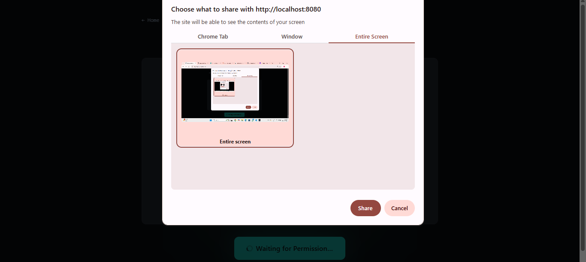

# Screen Share Test App (Frontend MERN Task)

A lightweight React frontend application that validates browser screen-sharing capabilities using native Web APIs.  
Built to demonstrate permission handling, media stream lifecycle management, and clean React state handling.

This project is part of a frontend shortlisting screen-sharing task.

---

## 🚀 Live Demo

👉 Deployed App: https://your-live-link-here  
👉 GitHub Repo: https://github.com/your-username/screen-share-test

---


## 🖼 Screenshots

### 🏠 Dashboard


### 📊 Screen Share


## 🛠 Tech Stack

- React (Vite)
- TypeScript (optional / bonus)
- Tailwind CSS / Plain CSS
- Native Browser Web APIs (`navigator.mediaDevices.getDisplayMedia`)

No third-party screen sharing libraries are used.

---

## 📦 Setup Instructions

### 1. Clone the repository

```bash
git clone https://github.com/your-username/screen-share-test.git
cd screen-share-test